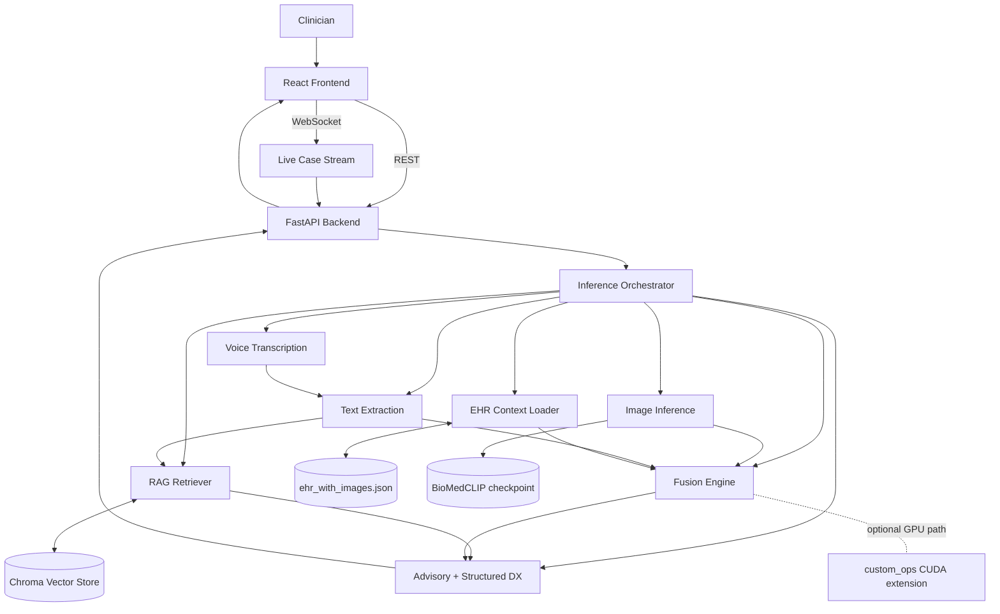

# MediSense AI — Multimodal Clinical Copilot

<p>
  
  
  
  
  
  
  
</p>

> A clinical decision-support copilot that fuses **text reasoning, voice transcription, chest X-ray inference, EHR retrieval, and RAG-grounded LLM summaries** behind a single FastAPI backend and a React clinician UI.

**Branch:** `full-application` — production-oriented integration of the frontend, backend, CI/CD and Docker deployment on top of the research `main` branch.

### What this system does

- Clinician types or dictates a case → backend transcribes and extracts symptoms, vitals, history
- EHR loader attaches patient context from MIMIC-IV Demo-derived records linked to CheXpert images
- Image module runs BioMedCLIP/BioViL-T on the chest X-ray
- Fusion engine combines text + image signals (Python baseline, optional CUDA kernel)
- RAG retriever grounds the LLM advisory in a local Chroma vector store
- Gemini-2.5 produces a structured differential + narrative summary streamed back to the UI

This README reflects the current codebase state after backend/frontend/data cleanup.

## Architecture



## Current Status

- EHR data is now generated from original-source MIMIC-IV Demo records and linked to local CheXpert images.
- Backend starts even when optional heavy dependencies are unavailable (imaging/LLM/voice degrade gracefully).
- Duplicate EHR routes removed and response contracts standardized with top-level `summary` fields.
- Frontend build issues fixed (missing modules, endpoint alignment, Docker output path).
- Smoke test runner added: `smoke_test.py`.

Audit and remediation roadmap: `docs/MASTER_PLAN.md`.

## Repository Map

- `api/`: FastAPI app (`api/server.py`)
- `core/`: extraction, retrieval, imaging, fusion, voice, diagnosis logic
- `frontend/`: React app
- `custom_ops/`: optional CUDA extension (`fusion_kernel.cu`, `bindings.cpp`)
- `scripts/build_ehr_from_mimic_demo.py`: reproducible EHR rebuild pipeline
- `smoke_test.py`: endpoint + websocket smoke checks

## Prerequisites

- Python 3.10+
- Node.js 18+
- Optional GPU path:
  - NVIDIA GPU
  - CUDA toolkit compatible with your PyTorch build

## Local Setup

1. Backend dependencies:

```bash
python3 -m venv .venv
source .venv/bin/activate
python3 -m pip install --upgrade pip
python3 -m pip install -r requirements.txt
```

2. Frontend dependencies:

```bash
cd frontend
npm install
cd ..
```

3. Optional: build CUDA fusion extension:

```bash
python3 setup.py install
```

Use this only if you plan to run fusion with `FUSION_BACKEND=cuda`.

## Environment Variables

Common variables:

- `CXR_CKPT` (default `checkpoints/biovil_vit_chexpert.pt`): imaging checkpoint path
- `CXR_DEVICE` (`cpu` or `cuda`): imaging model device override
- `FUSION_BACKEND` (`python` or `cuda`, default `python`)
- `FRONTEND_ORIGINS`: comma-separated CORS origins
- `GEMINI_API_KEY`: Google AI Studio API key
- `GEMINI_MODEL` (default `gemini-2.5-flash-lite`)
- `LLM_TEMPERATURE` (default `0.1`)
- `EXTRACTOR_USE_LLM` (`false` default): when `true`, merges optional LLM extraction with deterministic parser

## Run the System

1. Start backend:

```bash
uvicorn api.server:app --host 0.0.0.0 --port 8000
```

2. Start frontend (separate terminal):

```bash
cd frontend
# optional: export REACT_APP_API_URL=http://localhost:8000
npm start
```

3. Open:
- Frontend: `http://localhost:3000`
- API docs: `http://localhost:8000/docs`
- Health: `http://localhost:8000/health`

## Smoke Test

With backend running:

```bash
python3 smoke_test.py
```

Useful flags:

```bash
python3 smoke_test.py --base-url http://localhost:8000
python3 smoke_test.py --skip-voice
python3 smoke_test.py --skip-ws
python3 smoke_test.py --image chexpert/valid/patient64541/study1/view1_frontal.jpg
```

The script checks:
- `/health`
- `/infer`
- `/image_infer`
- `/multimodal_infer`
- `/structured_diagnosis`
- `/voice_transcribe` (unless skipped)
- `/api/case/voice`
- websocket `/ws/case/{id}` (unless skipped)

## Rebuild EHR Data from MIMIC-IV Demo

1. Place MIMIC-IV Demo CSVs under `data_sources/mimic_demo/`:
- `patients.csv`
- `admissions.csv`
- `omr.csv`
- `diagnoses_icd.csv`
- `d_icd_diagnoses.csv`
- `prescriptions.csv`

2. Run:

```bash
python3 scripts/build_ehr_from_mimic_demo.py
```

Outputs:
- `ehr_with_images.json`
- `ehr_image_index.json`

These records remain linked to local CheXpert image paths for multimodal workflows.

## Train / Refresh Imaging Checkpoint

If you want better image predictions than fallback behavior, train or refresh the head checkpoint:

```bash
python3 train_head_only.py \
  --csv chexpert/train.csv \
  --img_root chexpert \
  --epochs 3 \
  --batch_size 24 \
  --out checkpoints/biovil_vit_chexpert.pt
```

Hopper/distributed option:

```bash
torchrun --nproc_per_node=8 train/train_biomedclip_ddp.py \
  --csv chexpert/train.csv \
  --img_root chexpert \
  --epochs 5 \
  --mixed_precision \
  --bf16 \
  --out checkpoints/biovil_vit_chexpert.pt
```

Then restart backend (or set `CXR_CKPT` to your new output path) and rerun:

```bash
python3 smoke_test.py
```

## CUDA and NCCL Notes

- Current `custom_ops` uses CUDA kernels for elementwise fusion math.
- NCCL is not required for this single-process inference path.
- Use NCCL only if you add distributed multi-GPU training/inference (e.g., PyTorch DDP).
- For most current workflows, prioritize:
  1. getting a valid imaging checkpoint
  2. passing smoke tests
  3. enabling `FUSION_BACKEND=cuda` only after `custom_ops` builds cleanly

## Docker

Run both services:

```bash
docker-compose up --build
```

Endpoints:
- Backend: `http://localhost:8000`
- Frontend: `http://localhost:80`

## API Endpoints (Primary)

- `GET /health`
- `POST /infer`
- `POST /image_infer`
- `POST /multimodal_infer`
- `POST /structured_diagnosis`
- `POST /voice_transcribe`
- `POST /voice_infer`
- `POST /multimodal_voice_infer`
- `GET /ehr/patients`
- `GET /ehr/patients/{patient_id}`
- `POST /api/case/voice`
- `POST /api/case`
- `POST /api/case/{id}/finalize`
- websocket: `/ws/case/{id}`
- websocket: `/ws/transcribe` (raw 16 kHz PCM in, transcripts out)

---

## Branches

| Branch | Purpose |
|--------|---------|
| `main` | Original research / model-training codebase |
| `full-application` | End-to-end deployable app: React UI + FastAPI backend + Docker + CI/CD. **This branch.** |

## Built at HopHacks 2025

Originally prototyped at Johns Hopkins HopHacks and hardened afterwards into a full application.

**Team:** [@Mukaan17](https://github.com/Mukaan17) · [@Vishak25](https://github.com/Vishak25)

## License

MIT — see `LICENSE` if present, otherwise covered under the HopHacks 2025 submission terms.
