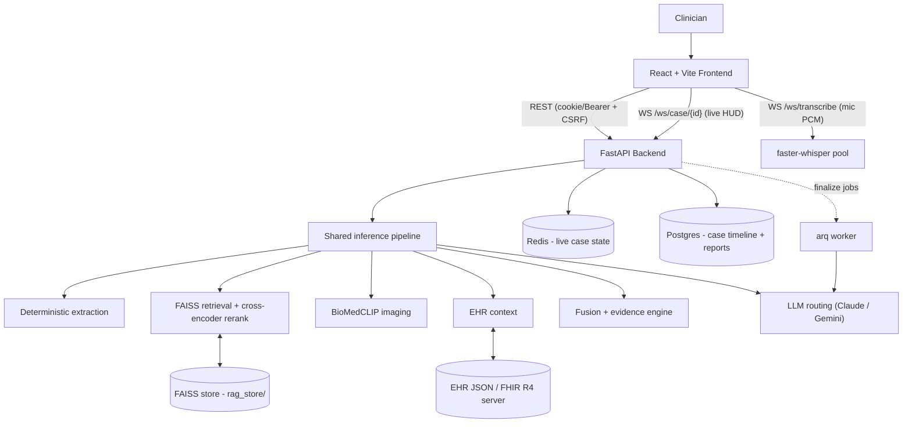

# MediSense AI — Multimodal Clinical Copilot

<p>
  
  
  
  
  
  
</p>

> An **advisory** clinical decision-support copilot: live voice
> transcription, deterministic clinical extraction, chest X-ray inference,
> EHR context, and RAG-grounded LLM reasoning behind one FastAPI backend
> and a React clinician UI. Every output is decision *support* — the
> system enforces advisory framing in code.

### What it does

- A clinician types or speaks a case; server-side streaming STT
  (faster-whisper over `/ws/transcribe`) turns mic audio into utterances.
- A deterministic extractor pulls symptoms, vitals, and history;
  an optional LLM pass merges on top (`EXTRACTOR_USE_LLM`).
- Retrieval over a FAISS knowledge base (MiniLM embeddings,
  cross-encoder re-ranking) grounds every hypothesis in reference
  material.
- The imaging module scores chest X-rays (BioMedCLIP head, CPU or GPU);
  fusion + an evidence engine combine text and image signals.
- A live HUD streams differential, confidence, red flags, and coach
  questions over `/ws/case/{id}` as the conversation grows; the deep
  final report is generated by the configured LLM (Claude primary,
  Gemini fallback, routed via `config/models.yaml`) — inline or through
  a Redis-backed job queue (`FINALIZE_MODE=queue`).
- With a durable store configured (`CASE_DB_URL`), every case keeps an
  append-only event timeline (created / utterances / HUD updates /
  feedback / report) queryable via the history API.

## Modes

| Mode | Data | Auth |
|---|---|---|
| `demo` (default) | Bundled synthetic dataset (MIMIC-IV demo records + unrelated CheXpert images, labeled synthetic) | None — frictionless |
| `clinical` | Operator-configured EHR (`EHR_JSON` file or a SMART-on-FHIR server via `EHR_SOURCE=fhir`) | Required: httpOnly session cookie (+ CSRF) or Bearer JWT; optional OIDC SSO (`AUTH_MODE=oidc`). Synthetic data and mocked integrations are refused. |

Clinical mode refuses to boot without `AUTH_SECRET_KEY` and refuses the
synthetic dataset at runtime. See `docs/COMPLIANCE.md` before pointing
real patient data at it.

## Architecture



The backend is a strictly modularized monolith (`docs/adr/0002`):
`api/` is the HTTP surface, `core/` is domain logic that never imports
`api/`, `worker/` consumes finalize jobs, `rag_runtime/` builds the KB
offline. Full module map: `docs/ARCHITECTURE.md`.

## Quickstart (local)

Prerequisites: Python 3.10+, Node.js 20+. No GPU required — imaging,
voice, and LLM features degrade gracefully when their dependencies or
keys are absent.

```bash
# Backend
python3 -m venv .venv && source .venv/bin/activate
pip install -r requirements.txt
cp .env.example .env             # fill in keys; empty keys = degraded mode
python -m rag_runtime.build_faiss_kb   # build the knowledge base once
uvicorn api.server:app --host 0.0.0.0 --port 8000

# Frontend (separate terminal)
cd frontend
npm ci
# optional: export VITE_API_URL=http://localhost:8000
npm start
```

Open the app at `http://localhost:3000`, API docs at
`http://localhost:8000/docs`, health at `http://localhost:8000/health`
(reports exactly which subsystems are live: KB doc count, imaging,
LLM keys, EHR source).

Smoke-check a running backend: `python3 smoke_test.py`
(`--skip-voice`, `--skip-ws`, `--base-url` supported).

## API surface

The committed contract is `openapi.json` (33 operations, dual-mounted at
`/` and `/v1`); the frontend's TypeScript types are generated from it
(`npm run gen:api`). CI fails on drift in either direction. Groups:

- **System**: `/health`, `/metrics` (Prometheus), `/reload_ehr`,
  `/reload_retriever`, `/knowledge_base/mode`
- **Auth**: `/auth/login` (cookie session + CSRF), `/auth/logout`,
  `/auth/me`, `/auth/ws-ticket`, `/auth/oidc/login|callback`
- **Inference**: `/infer`, `/image_infer`, `/multimodal_infer`,
  `/structured_diagnosis`, `/quick_analysis`, `/infer_from_image_only`
- **Voice**: `/voice_transcribe`, `/voice_infer`, `/multimodal_voice_infer`
- **EHR**: `/ehr/patients[/{id}]` (+ demo-only mockups)
- **Cases**: `POST /api/case[/voice]`, `/api/case/{id}/finalize`,
  `/api/case/{id}/report` (queue polling), `/api/case/{id}/feedback`,
  `/api/case/{id}/transcribe`
- **History** (needs `CASE_DB_URL`): `GET /api/cases`,
  `GET /api/case/{id}/timeline`
- **WebSockets** (not in OpenAPI): `/ws/case/{id}` live HUD,
  `/ws/transcribe` raw 16 kHz PCM in → transcripts out. Clinical mode
  authenticates sockets with short-lived tickets from `/auth/ws-ticket`.

## Testing & CI

```bash
.venv/bin/python -m pytest tests/ -q          # backend (147 tests)
.venv/bin/ruff check . --exclude frontend
cd frontend && npx tsc --noEmit && npm test   # types + unit (vitest)
npm run build && npx playwright test e2e/demo # E2E incl. fake-mic voice flow
APP_MODE=clinical npx playwright test e2e/clinical
```

CI (`.github/workflows/ci.yml`) is path-filtered and gates on: lint,
OpenAPI + generated-types freshness, backend tests with a coverage
ratchet, frontend types/tests/build, schemathesis contract fuzzing,
Playwright E2E, and blocking dependency audits. Images build only after
all gates pass, are Trivy-scanned (fixable HIGH/CRITICAL blocks),
SBOM'd (syft), and cosign-signed when a signing key is configured.
Weekly report-only mutation testing tracks suite quality.

## Deployment

- **Docker Compose** (CPU, any laptop): `cp .env.example .env` then
  `docker compose up --build`. Includes Redis, Postgres, and the
  finalize worker; the frontend nginx serves the app and proxies
  REST + WebSockets same-origin. GPU imaging:
  `-f docker-compose.gpu.yml`. Observability stack (Prometheus,
  Alertmanager, Grafana + dashboard):
  `-f docker-compose.observability.yml`.
- **AWS ECS**: `infra/terraform/` is the validated, canonical
  deployment (VPC, ALB, Fargate services + worker, EFS, ElastiCache,
  RDS, scoped IAM, autoscaling, deployment circuit breaker). The
  GPU-imaging variant and background are in `aws_ecs_deployment.md`.
- **Runtime frontend config**: one frontend build runs against any
  backend — `config.js` is templated at container start.

## Documentation index

| Document | What it covers |
|---|---|
| `docs/ARCHITECTURE.md` | Module map, dependency rules, contract gate |
| `docs/RUNBOOK.md` | Operations: restart/reload, KB rebuild, triage by alert |
| `docs/COMPLIANCE.md` | Data classes, PHI flow, requirements before real PHI |
| `docs/PRODUCTION_READINESS.md` | What's done vs. what still blocks clinical go-live |
| `docs/PERF_BASELINE.md` | Latency/coverage/mutation baselines + supply-chain triage |
| `docs/adr/` | Architecture decision records |
| `docs/IMPLEMENTATION_PLAN.md` | The executed improvement plan (I0–I17) + execution record |
| `docs/IMPROVEMENT_ROADMAP.md`, `docs/MASTER_PLAN.md`, `docs/REAUDIT.md` | Historical: roadmap and audit records |
| `infra/terraform/README.md` | ECS deployment usage and owner-provided inputs |
| `config/prompts/PROMPTS.md` | Prompt registry |
| `CHANGELOG.md` | Notable changes by engineering round |

## Data

The bundled EHR is synthetic: MIMIC-IV Clinical Demo v2.2 records paired
with **unrelated** CheXpert images (`ehr_synthetic: true` in `/health`).
Rebuild it from the MIMIC-IV demo CSVs with
`scripts/build_ehr_from_mimic_demo.py`. To train or refresh the imaging
head, see `train_head_only.py` (GPU recommended; `train_chexpert.slurm`
for cluster runs), then point `CXR_CKPT` at the new checkpoint. An
optional CUDA fusion kernel lives in `custom_ops/` (`python3 setup.py
install`, then `FUSION_BACKEND=cuda`); the default pure-Python fusion
path is equivalent.

## Origin

Prototyped at Johns Hopkins HopHacks 2025, then hardened through three
engineering rounds (remediation P0–P13, hardening R1–R8, improvement
I0–I17 — see `CHANGELOG.md`).

**Team:** [@Mukaan17](https://github.com/Mukaan17) · [@Vishak25](https://github.com/Vishak25)

## License

MIT intended; the `LICENSE` file has not been added yet (tracked in
`docs/PRODUCTION_READINESS.md` — a choice for the repository owners).
