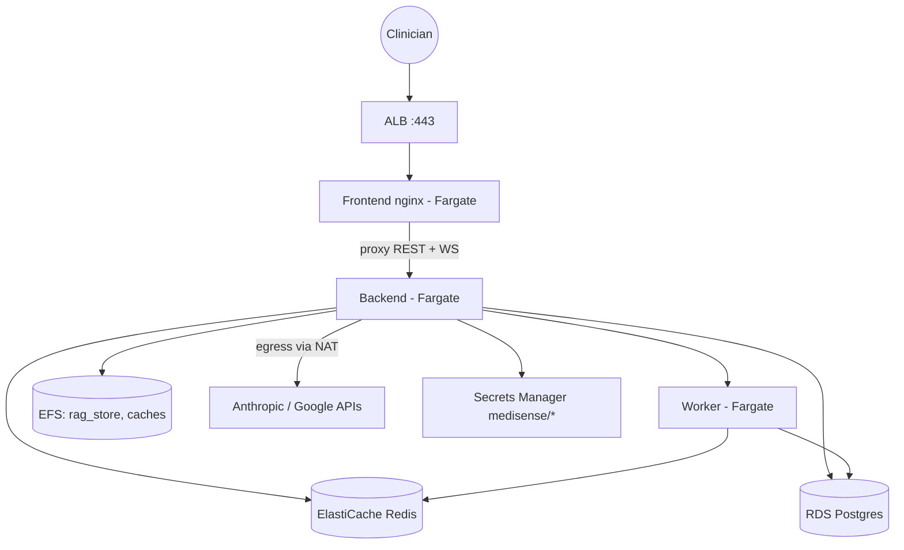

# AWS ECS Deployment

**The canonical deployment is code**: `infra/terraform/` provisions the
whole stack and `infra/terraform/README.md` documents usage and the
owner-provided inputs (state backend, certificate ARN, secrets). This
document is the companion narrative: what the architecture is, how images
reach it, and the GPU variant the Terraform deliberately does not cover.

## Architecture (what the Terraform builds)

- **VPC** with 2 public + 2 private subnets across two AZs; NAT gateway
  for private-subnet egress (LLM APIs, model downloads).
- **ALB** on 443 (TLS via `certificate_arn`) with a single target group:
  the frontend nginx service. nginx serves the static app and
  reverse-proxies every non-static path — REST *and* WebSockets — to the
  backend's Cloud Map name (`backend.medisense.internal`), so the
  backend needs no public exposure and no CORS surface. ALB idle timeout
  is 120 s for the live WebSockets.
- **ECS Fargate services**: backend (uvicorn), worker (arq finalize
  queue + retention cron, same image), frontend (nginx). CPU
  target-tracking autoscaling; the ECS deployment circuit breaker rolls
  back a bad deploy automatically.
- **EFS** access point mounted at the RAG store/cache paths — the KB and
  model caches survive task restarts.
- **ElastiCache Redis** (multi-AZ, failover) for shared live-case state;
  **RDS Postgres** for the durable case store (`CASE_DB_URL`).
- **ECR** repositories `clinical-ai-backend` / `clinical-ai-frontend`;
  **Secrets Manager** entries under the `medisense/` prefix
  (`AUTH_SECRET_KEY`, LLM keys, DSNs) resolved by `core/secrets` at boot.

## Image pipeline

CI (`.github/workflows/ci.yml`) builds both images on pushes to the
release branches **only after** the test, contract, E2E, and blocking
dependency-audit jobs pass, then Trivy-scans them (fixable HIGH/CRITICAL
fails the build), attaches an SPDX SBOM artifact, pushes SHA-tagged
images to ECR, and cosign-signs the pushed digest when
`COSIGN_PRIVATE_KEY` is configured. Point the ECS task definitions at
the SHA tags; rollback is redeploying the previous SHA (the circuit
breaker automates the failure case).

## Verification after a deploy

1. `https://<alb-dns>/health` — check `doc_count` (KB mounted from EFS),
   `image_model_loaded`, the `llm` booleans, and in clinical mode
   `ehr_synthetic: false`.
2. Restart the backend task: live cases survive in Redis, the KB reloads
   from EFS, history survives in RDS.
3. Run the demo E2E suite against a staging ALB, or `smoke_test.py
   --base-url https://<alb-dns>`.

## GPU variant (not in the Terraform)

Fargate is CPU-only. For GPU imaging throughput, add an EC2 capacity
provider with `g4dn.xlarge` instances and move the backend service onto
it (launch type EC2, one GPU per task, image built from the CUDA
`Dockerfile`). Everything else — ALB, EFS, Redis, RDS, secrets — is
unchanged; the CPU path remains the fallback since every model degrades
gracefully. Do this only when imaging volume demands it; the CPU
baseline numbers in `docs/PERF_BASELINE.md` are the decision input.

## Deliberately deferred

CodeDeploy blue/green (the circuit breaker covers rollback for now) and
a multi-stage promotion flow — tracked in `docs/PRODUCTION_READINESS.md`.
